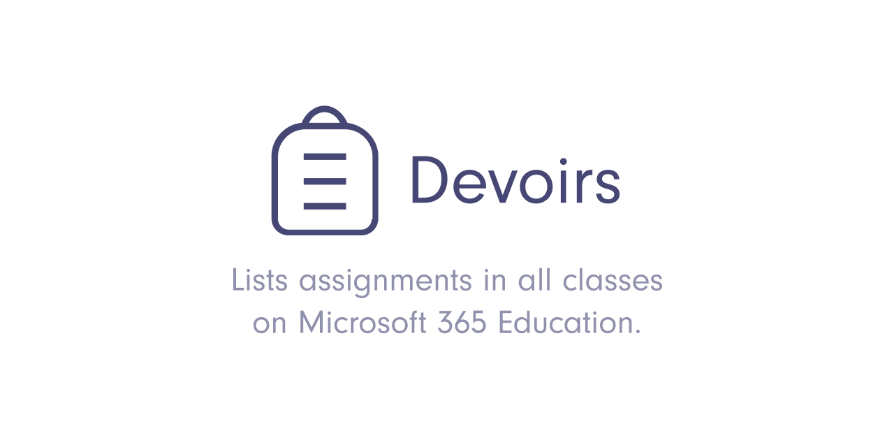

## ⚠ Deprecated ⚠
This project is no longer maintained because Microsoft Teams released the same function officialy.
Future releases will be only security updates.
Sorry for inconvinience, and thank you all current users.

  

## 📷 Screenshot

## ✔ Prerequisites
- Node.js 13+
- npm

## 📦 Usage
1. Clone this repository.
1. Install dependencies via `npm install` .
1. Run `npm start` to start the application .
1. Authorize Microsoft Teams with your account.
1. Done!
